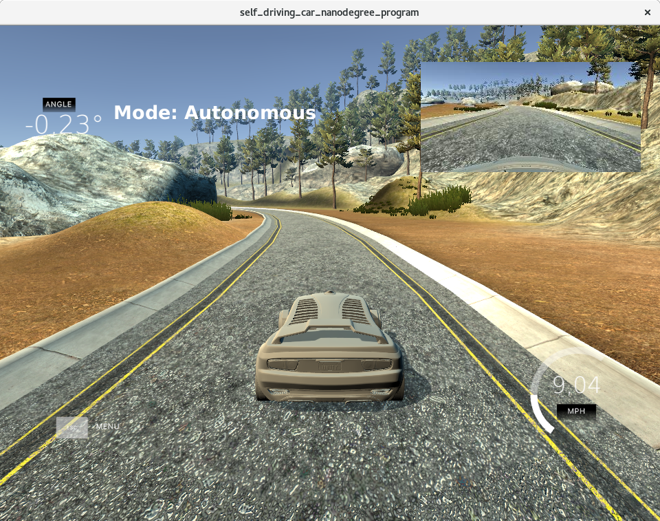
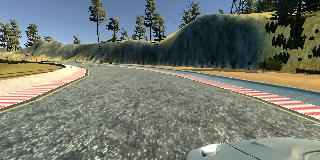
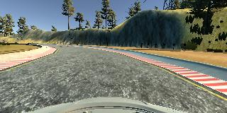
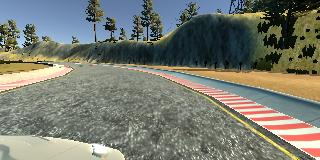
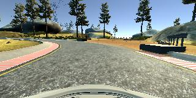
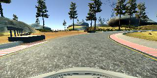
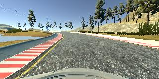
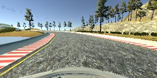
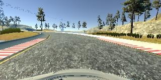

# Self Driving Car Behavioral Cloning

## Overview
This project consists of the development and training of a Deep Neural Network to clone human behavior for self-driving purpose. It uses the Car Simulator for training, test and validation. 

During the training phase, we navigate our car inside the simulator using the keyboard. While we navigating the car the simulator records training images and respective steering angles. Then we use those recorded data to train our neural network. Trained model was tested on two tracks, namely training track and validation track. 



## Getting started

### Installation 

To run this project, you need [Miniconda](https://conda.io/miniconda.html) installed(please visit [this link](https://conda.io/docs/install/quick.html) for quick installation instructions.)

To create an environment for this project use the following command:

```
conda env create -f environment.yml
```

After the environment is created, it needs to be activated with the command:

```
source activate self-driving
```

### Access 

The source code for this project is available at [project code](https://github.com/hparik11/Car-Behavioral-Cloning).

### Files

The following files are part of this project:

* model.py :   Contains the Convolution Neural Network implemented using Keras framework, together with the pipeline necessary to train and validate the model
* md_nvidia.h5 :   Nvidia architecture model weights saved during training
* drive.py : Script that connects the NN with the Car Simulator for testing and validation
* data :     Data source used for training and validation.
* run.mp4 :   Video of the car driving autonomously on track one.


## How to use this project

### Training the Model

The Convolution Neural Network provided with this project can be trained by executing the following command:

```sh
python model.py
```

### Driving Autonomously
To drive the car autonomously, this project requires the [Udacity Simulator](https://github.com/udacity/self-driving-car-sim). After installing and starting the simulator, the car can be driven autonomously around the track by executing the following command:
```sh
python drive.py md_nvidia.h5
```

The above command will load the trained model and use the model to make predictions on individual images in real-time and send the predicted angle back to the server via a websocket connection.


## Training Data 

The data set used to train the model was obtained from the Udacity Simulator. The procedure to collect data followed an empirical process. First, we have driven three laps, in one direction only, at the first track  trying to stay as much as possible aligned at the center of the road. 

### Data Capturing

During the training, the simulator captures data with a frequency of 10hz. Also, at a given time step it recorded three images taken from left, center, and right cameras. The following figure shows an example I have collected during the training time.

Left| Center | Right
----|--------|-------
 |  | 

To augment the data sat, I also flipped images and angles thinking that this would ... For example, here is an image that has then been flipped:

 | 

Collected data are processed before feeding into the deep neural network and those preprocessing steps are described in the latter part of this file. 

After this first batch of data collection, I tried to train the model. From the behavior shown by our car, we have observed that our model failed on the sharp corners where the side lanes are blurred. From this observation, we collected more data concerning these corners, which are the corners after the bridge. 

I then recorded the vehicle recovering from the left side and right sides of the road back to center so that the vehicle would learn to position itself on the center of the track. These images show what a recovery from the left side of the track looks like:

 |  | 

The recovery from sides was also achieved using the left and right camera images by adding a "correction angle" to the steering to force the car to regain the center of the road. Finally, the data collection was also augmented by flipping the center camera image otherwise the car would have a tendency to turn to the left because we collected data following only one direction. All this together proved sufficient to achieve the smooth steering shown in our results ([video](https://github.com/hparik11/Car-Behavioral-Cloning/blob/master/run.mp4)).


## Model Architecture and Training Strategy

My initial approach was to use [LeNet](http://yann.lecun.com/exdb/lenet/), but it was hard to have the car inside the street with three epochs (this model could be found [here](model.py#L81-L94)). After this, I decided to try the [Nvidia Autonomous Car Group](https://devblogs.nvidia.com/parallelforall/deep-learning-self-driving-cars/) model, and the car drove the complete first track after just three training epochs (this model could be found [here](model.py#L113-L130)).


### Final Model Architecture

The final model architecture (model.py lines 64-81) consisted of a convolution neural network with the following layers and layer sizes:

| Layer         		|     Description	        					                | 
|:---------------------:|:---------------------------------------------:                | 
|Input                  | RGB image (160,320,3)                                         |
|Lambda |                          Normalize the image pixels, outputs (None, 160, 320, 3)|                                
|Cropping2D |                                  Crops the image, outputs (None, 90, 320, 3)|                                
|Convolution2D | 5X5 kernel, (2,2) sampling, relu activation, outputs(None, 43, 158, 24)    |
|Convolution2D | 5X5 kernel, (2,2) sampling, relu activation, outputs(None, 20, 77, 36)    |
|Convolution2D | 5X5 kernel, (2,2) sampling, relu activation, outputs(None, 8, 37, 48)    |
|Convolution2D | 3X3 kernel, relu activation, outputs(None, 6, 35, 64)    |
|Convolution2D | 3X3 kernel, relu activation, outputs(None, 4, 33, 64)    |
|Flatten                                                         |outputs (None, 8448)              |
|Dense                                                           |outputs (None, 100)                |
|Dropout (0.05)                                                  |outputs (None, 100)                |              
|Dense                                                           |outputs (None, 50)          |
|Dropout (0.05)                                                 |outputs (None, 50)                |
|Dense                                                          | outputs (None, 10)          |
|Dropout (0.05)                                                 |outputs (None, 10)                |
|Dense                                                          | (None, 1)            |    


